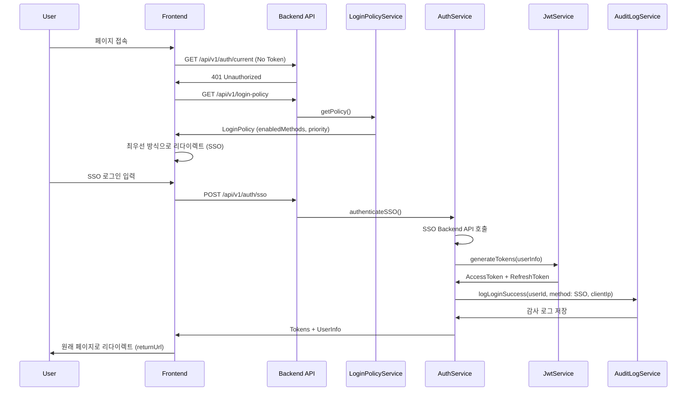
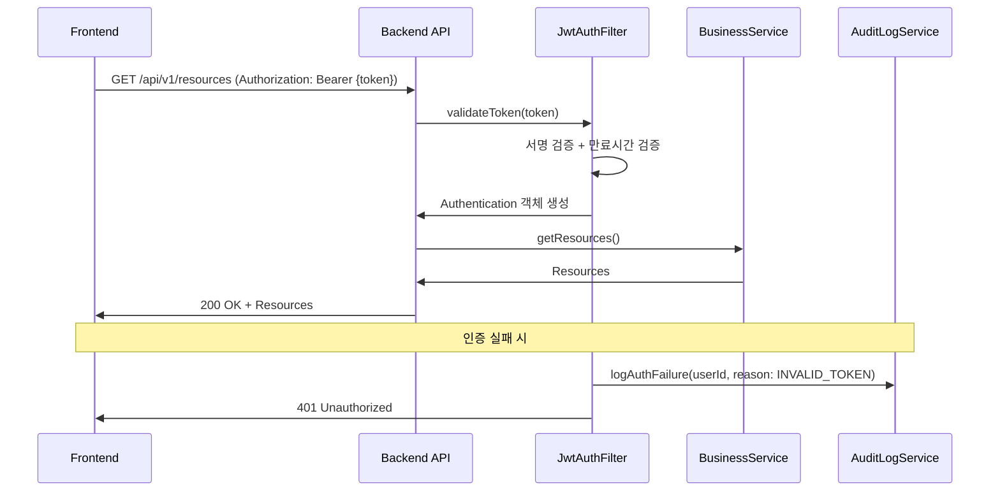

# Cross-Cutting Concerns (횡단 관심사)

> **모든 도메인에 걸쳐 적용되는 공통 기능 및 정책**
>
> 인증, 감사 로깅, 예외 처리 등 시스템 전반에 적용되는 횡단 관심사를 정의합니다.

---

## 📚 문서 구조

### 1. [🔐 로그인 정책 관리 (login-policy.md)](./login-policy.md)

**시스템 전체 로그인 정책 설정**

**읽어야 할 사람:**
- ⭐ 백엔드 개발자 (필수)
- ⭐ 프론트엔드 개발자 (필수)
- 시스템 아키텍트

**주요 내용:**
- **Domain Model**: LoginPolicy 엔티티 설계
  - 필수 필드: id, name, enabledMethods
  - 활성화된 로그인 방식: SSO, AD, LOCAL
  - 우선순위 설정 (priority)
- **Business Logic**:
  - `isMethodEnabled(method)` - 특정 방식 활성화 여부
  - `getPrimaryMethod()` - 최우선 로그인 방식 반환
  - `disableMethod(method)` - 방식 비활성화
- **Policy Update**: 정책 변경 및 버전 관리
- **Architecture**: Jenkins 시스템 설정 방식 (단일 글로벌 정책)

**관련 문서:**
- [authentication.md](./authentication.md) - 로그인 흐름 구현
- [jwt.md](./jwt.md) - 인증 후 JWT 발급
- [audit-logging.md](./audit-logging.md) - 정책 변경 감사 로그

---

### 2. [🛡️ 인증 보안 정책 (authentication.md)](./authentication.md)

**로그인 흐름 및 API 인증 정책**

**읽어야 할 사람:**
- ⭐ 백엔드 개발자 (필수)
- ⭐ 프론트엔드 개발자 (필수)
- 보안 담당자

**주요 내용:**
- **전체 시스템 인증 정책**:
  - 모든 기능 로그인 필수 (사내 업무시스템)
  - 비인증 접근 시 로그인 페이지 자동 리다이렉트
  - 세션 만료 시 자동 로그아웃
- **로그인 흐름 (Login Flow)**:
  - 비인증 사용자 → 정책 조회 → 최우선 방식으로 리다이렉트
  - SSO → AD → LOCAL 순서로 Fallback
  - 사용자 명시적 선택 시 Fallback 무시
  - 로그인 성공 → returnUrl로 리다이렉트
- **인증 필수/불필요 API**:
  - 필수: `/api/v1/**` (JWT Access Token 필요)
  - 예외: 비밀번호 리셋, Health Check
- **에러 처리**:
  - 401 Unauthorized (인증 실패)
  - 403 Forbidden (권한 부족)

**관련 문서:**
- [login-policy.md](./login-policy.md) - 정책 조회 로직
- [jwt.md](./jwt.md) - JWT 검증 및 인증
- [audit-logging.md](./audit-logging.md) - 로그인 성공/실패 로그

---

### 3. [🔑 JWT 토큰 관리 (jwt.md)](./jwt.md)

**JWT Access/Refresh Token 생성 및 검증**

**읽어야 할 사람:**
- ⭐ 백엔드 개발자 (필수)
- 보안 담당자

**주요 내용:**
- **Token Generation (생성)**:
  - Access Token: 1시간 만료 (3600초)
  - Refresh Token: 24시간 만료 (86400초)
  - 클레임: subject (employeeId), userId, name, email, roles
  - 알고리즘: HMAC-SHA256 (HS256)
  - 비밀키: 최소 256비트
- **Token Validation (검증)**:
  - 서명 검증 (HMAC-SHA256)
  - 만료시간 검증 (exp)
  - 발급자 검증 (iss)
  - 클레임 추출 및 검증
- **Token Refresh (갱신)**:
  - Refresh Token으로 새 Access Token 발급
  - Refresh Token 재발급 (Sliding Session)
- **Security (보안)**:
  - 비밀키 환경변수 관리 (JWT_SECRET)
  - 토큰 블랙리스트 (로그아웃 시)
  - Refresh Token 탈취 방지 (IP/User-Agent 검증)

**관련 문서:**
- [authentication.md](./authentication.md) - JWT 기반 API 인증
- [audit-logging.md](./audit-logging.md) - 토큰 발급/갱신 로그

---

### 4. [📝 감사 로깅 (audit-logging.md)](./audit-logging.md)

**시스템 모든 행위에 대한 감사 로그 기록**

**읽어야 할 사람:**
- ⭐ 백엔드 개발자 (필수)
- QA/테스터
- 컴플라이언스 담당자

**주요 내용:**
- **Login Success (로그인 성공)**:
  - 필수 필드: userId, employeeId, username, orgId
  - 추가 정보: clientIp, User-Agent, sessionId, loginAt
  - details JSON: roles, permissions, orgName
- **Login Failure (로그인 실패)**:
  - 실패 사유 분류: INVALID_CREDENTIALS, USER_NOT_FOUND, ACCOUNT_LOCKED, ACCOUNT_DISABLED
  - 필드: username, attemptedMethod, clientIp, User-Agent
- **Data Modification (데이터 변경)**:
  - before_json, after_json (변경 전/후 상태)
  - action: CREATE, UPDATE, DELETE
- **Audit Log Storage**:
  - 테이블: AUDIT_LOG
  - 보관 기간: 7년 (금융권 규정)
  - 파티셔닝: 월별 파티션

**관련 문서:**
- [authentication.md](./authentication.md) - 로그인 흐름
- [login-policy.md](./login-policy.md) - 정책 변경 로그
- [../layers/layer-3-infrastructure.md](../layers/layer-3-infrastructure.md) - AuditLogMapper 구현

---

### 5. [⚙️ 기타 횡단 관심사 (misc.md)](./misc.md)

**비밀번호 관리, 예외 처리 등**

**읽어야 할 사람:**
- 백엔드 개발자

**주요 내용:**
- **Password Management**:
  - BCrypt 암호화 (strength: 10)
  - 평문 비밀번호 검증
- **Exception Handling**:
  - GlobalExceptionHandler
  - 400 Bad Request: MethodArgumentNotValidException, IllegalArgumentException
  - 404 Not Found: EntityNotFoundException
  - 409 Conflict: DuplicateEntityException
  - 500 Internal Server Error: 기타 예외

**관련 문서:**
- [../implementation/exception-handling.md](../implementation/exception-handling.md) - 예외 처리 상세 가이드

---

## 🔄 Cross-Cutting Concerns 통합 흐름

### 1. 로그인 흐름 전체 (End-to-End)



### 2. API 요청 흐름 (JWT 인증)



### 3. 감사 로그 기록 시점

**모든 중요 행위에 대해 감사 로그 기록:**

| 시점 | Action | 기록 내용 |
|------|--------|-----------|
| 로그인 성공 | LOGIN_SUCCESS | userId, method, clientIp, User-Agent, sessionId |
| 로그인 실패 | LOGIN_FAILURE | username, attemptedMethod, reason, clientIp |
| 로그아웃 | LOGOUT | userId, sessionId, logoutAt |
| 토큰 갱신 | TOKEN_REFRESH | userId, tokenId, clientIp |
| 정책 변경 | POLICY_UPDATE | userId, before_json, after_json |
| 데이터 생성 | CREATE | userId, entityType, entityId, after_json |
| 데이터 수정 | UPDATE | userId, entityType, entityId, before_json, after_json |
| 데이터 삭제 | DELETE | userId, entityType, entityId, before_json |

---

## 🎯 개발자 가이드

### Backend 개발자가 구현해야 할 항목

#### 1. 로그인 정책 관리

```java
// LoginPolicyService.java
public class LoginPolicyService {
    public LoginPolicy getPolicy() {
        // 시스템 전역 정책 조회 (단일 정책)
    }

    public void updatePolicy(LoginPolicyUpdateRequest request) {
        // 정책 업데이트 (버전 관리)
        // 감사 로그 기록 (POLICY_UPDATE)
    }
}
```

**체크리스트:**
- [ ] LoginPolicy 엔티티 생성 (id, name, enabledMethods, priority)
- [ ] LoginPolicyService 구현 (getPolicy, updatePolicy)
- [ ] LoginPolicyController 구현 (GET /api/v1/login-policy)
- [ ] 정책 변경 감사 로그 기록

#### 2. 인증 서비스

```java
// AuthService.java
public class AuthService {
    public AuthResponse authenticateSSO(SsoLoginRequest request) {
        // SSO Backend API 호출
        // JWT 토큰 생성
        // 감사 로그 기록 (LOGIN_SUCCESS)
    }

    public AuthResponse authenticateAD(AdLoginRequest request) {
        // AD 서버 LDAP 인증
        // JWT 토큰 생성
        // 감사 로그 기록 (LOGIN_SUCCESS)
    }

    public AuthResponse authenticateLocal(LocalLoginRequest request) {
        // DB 사용자 조회 및 비밀번호 검증
        // JWT 토큰 생성
        // 감사 로그 기록 (LOGIN_SUCCESS)
    }
}
```

**체크리스트:**
- [ ] AuthService 구현 (SSO, AD, LOCAL 인증)
- [ ] AuthController 구현 (POST /api/v1/auth/sso, /ad, /local)
- [ ] 로그인 성공/실패 감사 로그 기록
- [ ] 비밀번호 암호화 (BCrypt)

#### 3. JWT 토큰 관리

```java
// JwtService.java
public class JwtService {
    public TokenPair generateTokens(UserInfo userInfo) {
        // Access Token (1시간) + Refresh Token (24시간) 생성
    }

    public Claims validateToken(String token) {
        // 서명, 만료시간, 발급자 검증
    }

    public TokenPair refreshTokens(String refreshToken) {
        // Refresh Token으로 새 Access Token 발급
        // 감사 로그 기록 (TOKEN_REFRESH)
    }
}
```

**체크리스트:**
- [ ] JwtService 구현 (generateTokens, validateToken, refreshTokens)
- [ ] JwtAuthFilter 구현 (요청마다 토큰 검증)
- [ ] Refresh Token 엔드포인트 (POST /api/v1/auth/refresh)
- [ ] 토큰 갱신 감사 로그 기록

#### 4. 감사 로깅

```java
// AuditLogService.java
public class AuditLogService {
    public void logLoginSuccess(String userId, LoginMethod method, String clientIp) {
        // 감사 로그 저장 (LOGIN_SUCCESS)
    }

    public void logLoginFailure(String username, LoginMethod method, String reason, String clientIp) {
        // 감사 로그 저장 (LOGIN_FAILURE)
    }

    public void logDataChange(String userId, String action, String entityType, String entityId,
                               String beforeJson, String afterJson) {
        // 감사 로그 저장 (CREATE, UPDATE, DELETE)
    }
}
```

**체크리스트:**
- [ ] AuditLogService 구현
- [ ] AuditLogMapper 구현 (MyBatis)
- [ ] AUDIT_LOG 테이블 생성
- [ ] 모든 중요 행위에 감사 로그 기록

#### 5. 예외 처리

```java
// GlobalExceptionHandler.java
@RestControllerAdvice
public class GlobalExceptionHandler {
    @ExceptionHandler(MethodArgumentNotValidException.class)
    public ResponseEntity<ErrorResponse> handleValidationException(MethodArgumentNotValidException e) {
        // 400 Bad Request
    }

    @ExceptionHandler(EntityNotFoundException.class)
    public ResponseEntity<ErrorResponse> handleNotFoundException(EntityNotFoundException e) {
        // 404 Not Found
    }

    @ExceptionHandler(DuplicateEntityException.class)
    public ResponseEntity<ErrorResponse> handleDuplicateException(DuplicateEntityException e) {
        // 409 Conflict
    }
}
```

**체크리스트:**
- [ ] GlobalExceptionHandler 구현
- [ ] 커스텀 예외 클래스 생성 (EntityNotFoundException, DuplicateEntityException)
- [ ] ErrorResponse DTO 생성
- [ ] 예외 발생 시 감사 로그 기록

---

### Frontend 개발자가 구현해야 할 항목

#### 1. 로그인 페이지

**파일 위치:** `frontend/pages/auth/login.vue`

**기능:**
- [ ] 로그인 정책 조회 (GET /api/v1/login-policy)
- [ ] 최우선 방식으로 자동 리다이렉트 (SSO → AD → LOCAL)
- [ ] 사용자 명시적 방식 선택 (탭 UI)
- [ ] SSO 로그인 폼 (사번만 입력)
- [ ] AD 로그인 폼 (사번 + 비밀번호)
- [ ] LOCAL 로그인 폼 (사번 + 비밀번호)
- [ ] 로그인 실패 에러 메시지 표시
- [ ] 로그인 성공 시 returnUrl로 리다이렉트

#### 2. 인증 상태 관리

**파일 위치:** `frontend/shared/store/auth.store.ts`

```typescript
// auth.store.ts (Pinia)
export const useAuthStore = defineStore('auth', {
  state: () => ({
    accessToken: null,
    refreshToken: null,
    user: null,
    isAuthenticated: false,
  }),

  actions: {
    async login(credentials: LoginCredentials) {
      // POST /api/v1/auth/{sso|ad|local}
      // 토큰 저장 (localStorage)
      // 사용자 정보 저장
    },

    async refreshTokens() {
      // POST /api/v1/auth/refresh
      // 새 토큰으로 교체
    },

    async logout() {
      // POST /api/v1/auth/logout
      // 토큰 삭제
      // 로그인 페이지로 리다이렉트
    },
  },
})
```

#### 3. API 요청 인터셉터

**파일 위치:** `frontend/shared/api/interceptors.ts`

```typescript
// Request Interceptor
axios.interceptors.request.use((config) => {
  const authStore = useAuthStore()
  if (authStore.accessToken) {
    config.headers.Authorization = `Bearer ${authStore.accessToken}`
  }
  return config
})

// Response Interceptor
axios.interceptors.response.use(
  (response) => response,
  async (error) => {
    if (error.response?.status === 401) {
      // Access Token 만료 → Refresh Token으로 갱신 시도
      const authStore = useAuthStore()
      await authStore.refreshTokens()

      // 원래 요청 재시도
      return axios(error.config)
    }
    return Promise.reject(error)
  }
)
```

#### 4. 라우트 가드

**파일 위치:** `frontend/app/router.options.ts`

```typescript
// router.options.ts
export default defineNuxtRouteMiddleware((to, from) => {
  const authStore = useAuthStore()

  // 비인증 사용자 → 로그인 페이지로 리다이렉트
  if (!authStore.isAuthenticated && to.path !== '/auth/login') {
    return navigateTo(`/auth/login?returnUrl=${to.fullPath}`)
  }

  // 인증된 사용자 → 로그인 페이지 접근 시 홈으로
  if (authStore.isAuthenticated && to.path === '/auth/login') {
    return navigateTo('/')
  }
})
```

**체크리스트:**
- [ ] 로그인 페이지 구현 (SSO, AD, LOCAL 탭)
- [ ] Pinia 인증 스토어 구현
- [ ] API 인터셉터 구현 (토큰 자동 포함, 401 시 갱신)
- [ ] 라우트 가드 구현 (비인증 시 리다이렉트)
- [ ] 토큰 localStorage 저장/복원
- [ ] 로그아웃 구현

---

## 📖 참고 문서

### 관련 레이어 문서

- **[Layer 1: Domain](../layers/layer-1-domain.md)** - LoginPolicy, User 엔티티
- **[Layer 2: Application](../layers/layer-2-application.md)** - AuthService, LoginPolicyService
- **[Layer 3: Infrastructure](../layers/layer-3-infrastructure.md)** - AuditLogMapper, UserMapper
- **[Layer 4: Interface](../layers/layer-4-interface.md)** - AuthController, LoginPolicyController

### 구현 가이드

- **[Backend Guide](../implementation/backend-guide.md)** - 백엔드 구현 패턴
- **[Exception Handling](../implementation/exception-handling.md)** - 예외 처리 상세 가이드
- **[Frontend Guide](../implementation/frontend-guide.md)** - 프론트엔드 구현 패턴

### 아키텍처 문서

- **[Security Architecture](../../architecture/SECURITY.md)** - JWT 인증, 암호화, RBAC
- **[DDD Design](../../architecture/DDD_DESIGN.md)** - 도메인 주도 설계

### API 문서

- **[API Authentication](../../api/AUTHENTICATION.md)** - 인증 API 상세 명세
- **[API Endpoints](../../api/ENDPOINTS.md)** - 전체 API 엔드포인트

---

## 🔄 변경 이력

| 날짜 | 변경 내용 | 작성자 |
|------|-----------|--------|
| 2025-01-16 | 초안 생성 - Cross-Cutting Concerns 문서 센터 | PM |

---

## 📞 문의

**횡단 관심사 관련 문의:**
- GitHub Issues: #cross-cutting-concerns
- Slack: #inspect-hub-architecture
